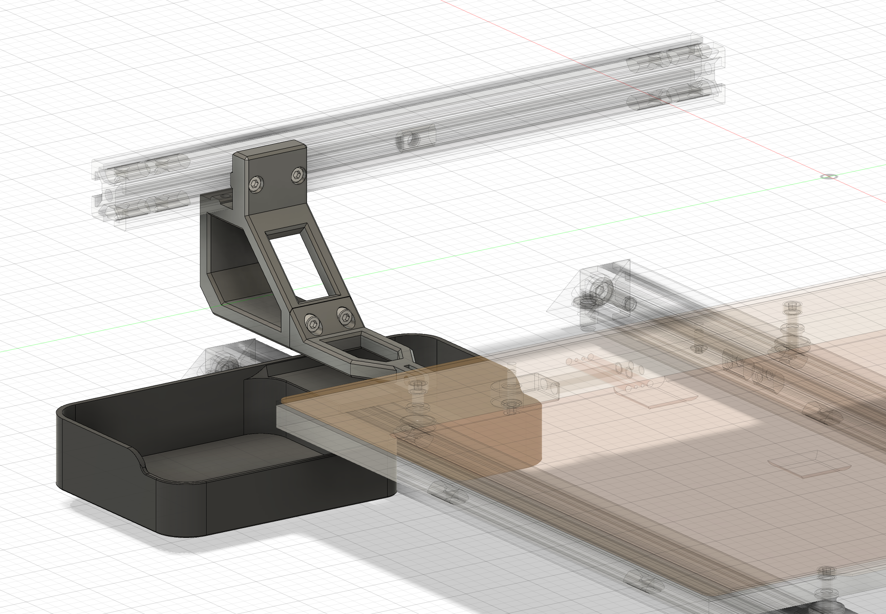

# Gantry-Attached Nozzle Scrubber

A nozzle scrubber that attaches to the gantry at the back of the printer, so you can purge and wipe the nozzle at any Z height. With other nozzle scrubbers attached next to the bed, you would need to move down to the bed surface to wipe the nozzle, which risks crashing into your printed parts.



## Bill of Materials

| Part | Quantity | Description
|---|---|---|
| M3 x 8mm SHCS | 4 | The count does not include 2 screws under the gantry which are not convenient to install.
| M3 T-nuts | 2 | The count does not include 2 t-nuts under the gantry which are not convenient to install.
| M3 heat insert | 2 | For connecting back and front parts.
| Silicone pad | 1 | Buy a cheap oven silicone mold on Amazon and cut up a small bit to brush the nozzle against. Attach it to the front of the nozzle scrubber.

## Configuration

Copy the file `config/nozzle_cleaning.cfg` from this repository to klipper's config folder. Include it in your `printer.cfg`:

```
[include nozzle_cleaning.cfg]
```

Update the variables in the macros `WIPE_NOZZLE` and `PURGE_IN_BUCKET` to reflect the location of the nozzle scrubber on your printer.
