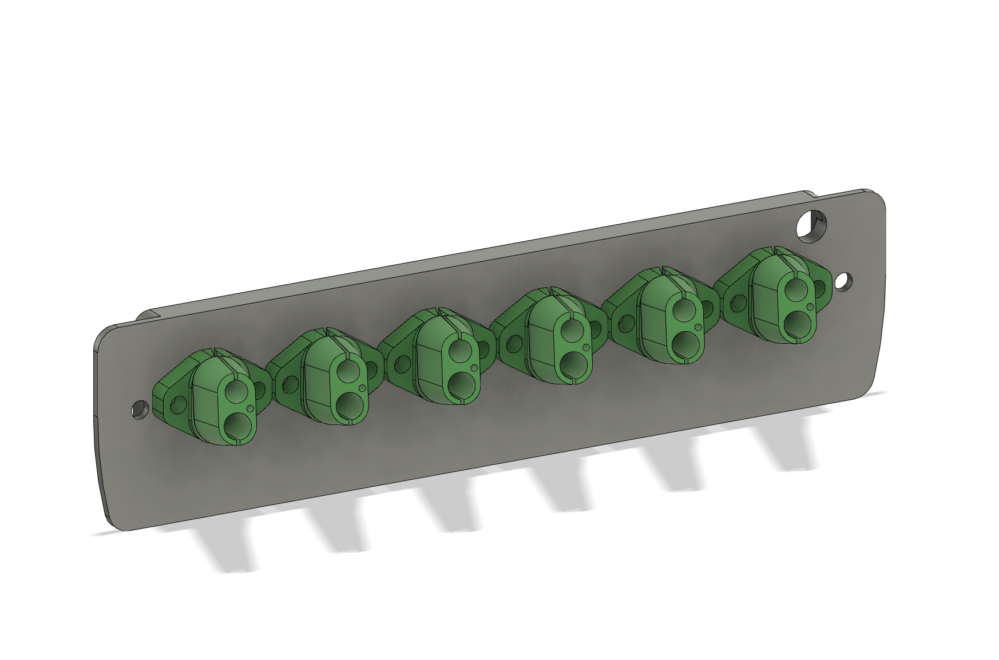
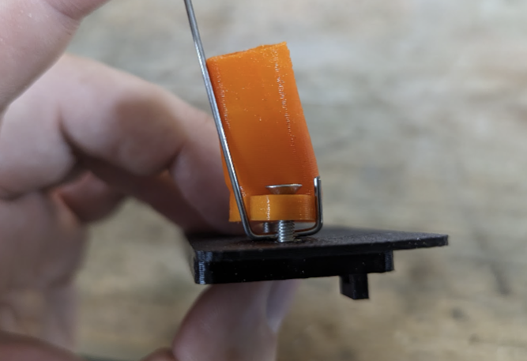

# TapChanger Exhaust Cover with screw-down strain reliefs

A version of [TapChanger](https://github.com/viesturz/tapchanger)'s exhaust cover and flexible strain relief parts which has M3 heat inserts for added rigidity.

In addition to the exhaust cover which should be printed in ABS, there are 3 TPU parts included:
* For 4.5mm cables like the ones shipped with BTT SB2209 boards
* For 5.6mm cables like the ones shipped with some later versions of the BTT SB2240 boards
* Blanks (no holes) to cover the unused spots in the exhaust cover

For added strain relief, bend a 1.20mm metal wire under the TPU parts like so:

## Bill of Materials

| Part | Quantity | Description
|---|---|---|
| M3 x 8mm BHCS | 12 | 2 per strain relief parts
| M3 heat insert | 12 | For the exhaust cover
