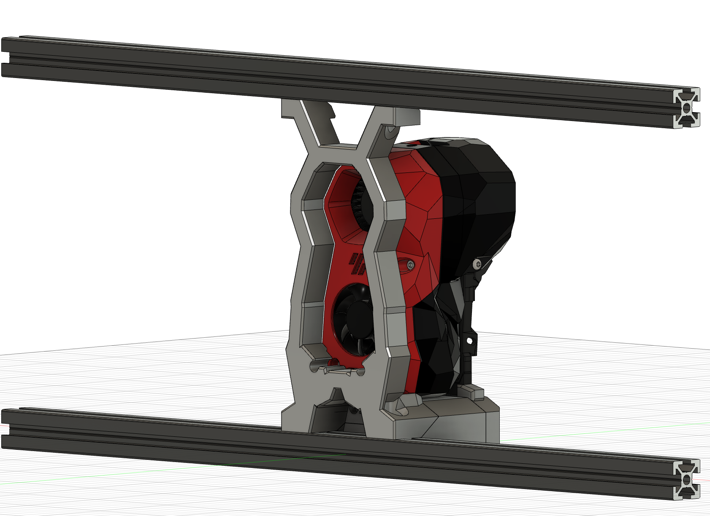

# TapChanger Rigid Dock (a.k.a. the bunny dock)

A version of [TapChanger](https://github.com/viesturz/tapchanger)'s dock with added rigidity, it is attached at the top and bottom to 2020 extrusions to ensure the dock will stay in place without twisting. The Stealthburner is held in place with 8 magnets which keeps it very solidly in place in the dock.

## Bill of Materials

| Part | Quantity | Description
|---|---|---|
| M5 x 12mm BHCS | 6 | Holds the dock to the 2020 extrusions.
| M5 T-nut | 6 | Holds the dock to the 2020 extrusions.
| M3 heat set insert | 4 | Add to the `Rigid Dock Base`.
| M3 x 8mm | 2 | Holds the `Rigid Dock Front` and Base together.
| M3 x 6mm | 2 | Holds the `Rigid Dock Back` and Base together.
| M3 x 10mm | 1 | Holds the wiper into the `Rigid Dock Base`.
| 6mm x 7mm round magnet | 8 | Add 2 magnets to the stealthburner bottom front screw holes, they should stick out by ~1.5mm allowing for easy removal. Add 2 to the bottom of the `TapChanger Front With Magnets` part. The other 4 go into the `Rigid Dock Front` and `Rigid Dock Back`. A single dot of crazy glue may be necessary depending on your print settings.
| 6mm x 3mm round magnet | 1 | Glue in the `Rigid Dock Back` part to hold the TPU plug, as with the original TapChanger dock.

## Configuration

An example pickup and dropoff g-code for this dock is available in the `config` folder. The `park` location to use in your `[tool N]` config section is the location of the tool when fully docked (all magnets touch their mating counterpart). Use `zone: 0, 100, 0` to provide enough clearance when loading and unloading the tools (only Y is used, X and Z are ignored for `zone`).

## Some notes

1. On a 350mm printer, 5 of these docks will fit side by side without space between them. This is meant to allow removing one dock and putting it back in the exact same place.
2. Since the docks measure 80mm and touch each other on both sides, when adding a new tool simply add 80mm to the X offset for the previous tool as a starting point.
3. Install the left and right docks ~35mm from the door extrusions to provide enough clearance for the XY tensioners.